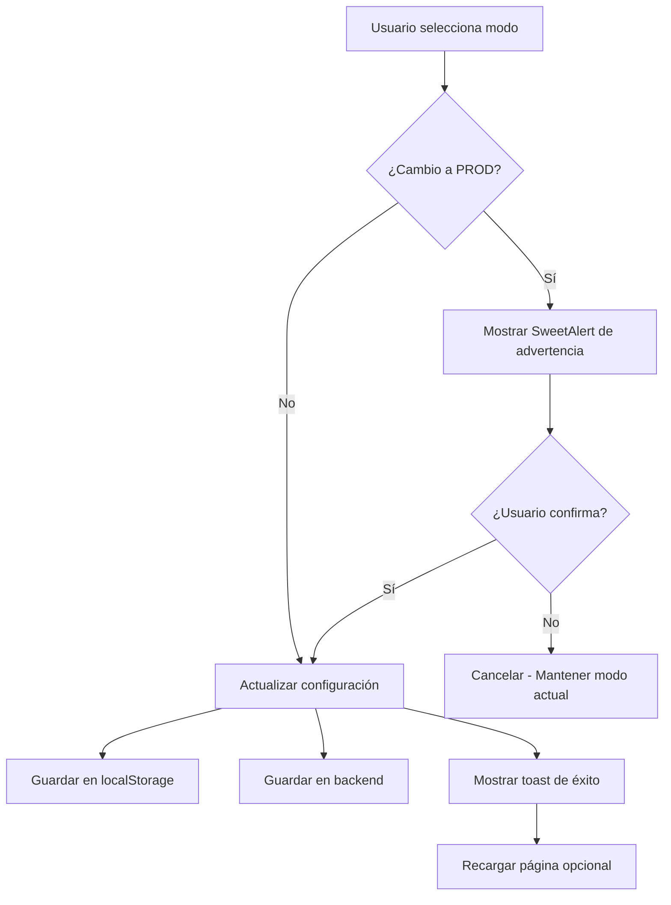

# Entorno Mock de Siigo - Modo DEV/PROD

## 📋 Descripción

Sistema de entorno dual para la integración con Siigo que permite trabajar en modo **Desarrollo (DEV)** con simulación completa sin costos, o en modo **Producción (PROD)** con la API real de Siigo.

## 🎯 Propósito

- **Desarrollo sin costos**: Permite probar la integración de Siigo sin hacer llamadas reales a la API
- **Pruebas ilimitadas**: Simula todas las operaciones localmente sin límites ni tarifas
- **Transición segura**: Cambio fácil entre entorno de pruebas y producción
- **Datos realistas**: Genera CUFEs, números de factura y respuestas que imitan el formato real

## 🏗️ Arquitectura

### Patrón Proxy
```
┌─────────────────────┐
│  siigoApiService    │ ← Punto de entrada único
│     (Proxy)         │
└──────────┬──────────┘
           │
           ├─── Mode: DEV → siigoMockService.js (Mock)
           │
           └─── Mode: PROD → siigoRealService.js (API Real)
```

### Archivos Principales

1. **`siigoApiService.js`** - Servicio proxy que delega según el modo
2. **`siigoMockService.js`** - Implementación mock completa (DEV)
3. **`siigoRealService.js`** - Implementación real con HTTP (PROD)
4. **`SiigoConfigTab.jsx`** - UI para cambiar entre modos
5. **`MainLayout.jsx`** - Badge visual del modo activo

## 🔧 Configuración

### Estructura de Configuración IPS

El modo se guarda en la configuración IPS con la clave `siigoMode`:

```javascript
{
  // ... otros campos de configuración
  siigoMode: "DEV" // o "PROD"
}
```

### Valores Permitidos

- **`DEV`** (por defecto): Modo desarrollo con mock
- **`PROD`**: Modo producción con API real

### Almacenamiento

- **Backend**: Tabla `configuracion` con clave `IPS_INFO`
- **LocalStorage**: `IPS_INFO` (sincronizado automáticamente)

## 📊 Modo Desarrollo (DEV)

### Características

✅ **Sin costos**: No se realizan llamadas HTTP reales
✅ **Latencia simulada**: Delays de 300ms - 1500ms para imitar red
✅ **Datos ficticios pero válidos**:
  - CUFEs de 96 caracteres (formato real)
  - Números de factura: `FE-XXXXXX`
  - IDs mock: `MOCK-INV-{timestamp}-{random}`
  
✅ **Operaciones soportadas**:
  - Crear facturas electrónicas
  - Crear notas crédito
  - Crear notas débito
  - Crear/listar clientes
  - Crear/listar productos
  - Consultar catálogos (tipos doc, impuestos, etc.)
  - Obtener PDFs (base64 simulado)
  - Enviar emails (simulado)

### Ejemplo de Respuesta Mock

```javascript
{
  id: "MOCK-INV-1734567890123-a1b2",
  number: "FE-123456",
  stamp: {
    cufe: "a1b2c3d4e5f6...96chars",
    status: "Aceptada",
    qr_code: "https://catalogo-vpfe.dian.gov.co/...",
    uuid: "a1b2c3d4-e5f6-..."
  },
  pdf: {
    url: "https://mock-pdf.siigo.com/...",
    base64: "data:application/pdf;base64,..."
  }
}
```

### Identificación

Todos los logs del mock usan el emoji 🧪:
```
🧪 [MOCK] Creando factura...
🧪 [MOCK] Factura creada exitosamente
```

## 🚀 Modo Producción (PROD)

### Características

⚠️ **API Real**: Todas las operaciones se ejecutan en Siigo
⚠️ **Costos reales**: Cada operación puede tener tarifas asociadas
⚠️ **Validez legal**: Los documentos son válidos ante la DIAN
⚠️ **Irreversible**: Documentos enviados no se pueden borrar

### Requisitos

1. Credenciales de Siigo válidas
2. Token de autenticación activo
3. Configuración completa en el módulo Siigo

### Identificación

Todos los logs del modo PROD usan el emoji 🚀:
```
🚀 [PROD] Creando factura REAL en Siigo...
✅ [PROD] Factura creada exitosamente
```

## 🎨 Interfaz de Usuario

### 1. Panel de Configuración

**Ubicación**: `Configuración → Siigo API`

**Componentes**:
- **SegmentedControl**: Selector visual entre DEV/PROD
- **Alert**: Descripción de características del modo activo
- **Badge**: Indicador de estado actual

**Colores**:
- 🧪 DEV: Azul (#339af0) - Fondo azul claro
- 🚀 PROD: Rojo (#fa5252) - Fondo rojo claro

### 2. Badge en Header

**Ubicación**: Esquina superior derecha del `MainLayout`

**Comportamiento**:
- Siempre visible cuando hay header
- Se actualiza automáticamente cada 2 segundos
- Animación pulse en modo PROD para llamar la atención

**Estilos**:
```jsx
<Badge 
  color={siigoMode === 'DEV' ? 'blue' : 'red'}
  leftSection={<IconFlask | IconRocket />}
>
  Siigo: 🧪 DEV | 🚀 PROD
</Badge>
```

### 3. Confirmación de Cambio a PROD

Al intentar cambiar a modo PROD, aparece un SweetAlert2 con:

**Título**: "⚠️ Activar Modo Producción"

**Contenido**:
- Advertencia sobre envío real a DIAN
- Validez legal de documentos
- Costos reales asociados
- Irreversibilidad de operaciones

**Botones**:
- ✅ "Sí, activar PRODUCCIÓN" (rojo)
- ❌ "Cancelar" (gris)

## 🔄 Flujo de Cambio de Modo



## 📝 Implementación Técnica

### Función `getSiigoMode()`

```javascript
function getSiigoMode() {
  try {
    const config = localStorage.getItem('IPS_INFO');
    if (config) {
      const parsedConfig = JSON.parse(config);
      const configData = typeof parsedConfig.jsonData === 'string' 
        ? JSON.parse(parsedConfig.jsonData) 
        : parsedConfig.jsonData || parsedConfig;
      
      return configData.siigoMode || 'DEV';
    }
  } catch (error) {
    console.error('Error leyendo configuración de Siigo:', error);
  }
  return 'DEV'; // Fallback seguro
}
```

### Función `getActiveService()`

```javascript
function getActiveService() {
  const mode = getSiigoMode();
  const service = mode === 'PROD' ? siigoRealService : siigoMockService;
  
  console.log(`📡 Siigo API Mode: ${mode} ${mode === 'DEV' ? '🧪' : '🚀'}`);
  
  return service;
}
```

### Proxy de Servicios

Todos los métodos del `siigoApiService` delegan al servicio activo:

```javascript
export const siigoInvoicesService = {
  async createInvoice(invoiceData) {
    return getActiveService().invoices.create(invoiceData);
  },
  // ... más métodos
};
```

## 🧪 Pruebas

### Verificar Modo Actual

```javascript
// Desde consola del navegador
const config = JSON.parse(localStorage.getItem('IPS_INFO'));
console.log('Modo actual:', config.jsonData.siigoMode);
```

### Cambiar Modo Manualmente (Solo para pruebas)

```javascript
const config = JSON.parse(localStorage.getItem('IPS_INFO'));
const data = JSON.parse(config.jsonData);
data.siigoMode = 'PROD'; // o 'DEV'
config.jsonData = JSON.stringify(data);
localStorage.setItem('IPS_INFO', JSON.stringify(config));
location.reload();
```

### Verificar Llamadas Mock

Todos los logs del mock incluyen `🧪 [MOCK]`:
```javascript
console.log('🧪 [MOCK] Creando factura:', facturaData);
```

### Verificar Llamadas Reales

Todos los logs del modo PROD incluyen `🚀 [PROD]`:
```javascript
console.log('🚀 [PROD] Creando factura REAL en Siigo:', facturaData);
```

## ⚡ Performance

### Tiempos de Respuesta

**Modo DEV (Mock)**:
- Autenticación: 400ms
- Crear factura: 1500ms
- Crear nota: 1200ms
- Consultar cliente: 500ms
- Listar catálogos: 300ms

**Modo PROD (Real)**:
- Variable según red y Siigo API
- Timeout: 120 segundos
- Promedio: 1-3 segundos

### Optimizaciones

- Mock usa `Promise.resolve()` con delays
- No hay operaciones de I/O en DEV
- Datos generados en memoria
- Sin límites de rate limiting en DEV

## 🔒 Seguridad

### Modo DEV
- No requiere credenciales reales
- No expone información sensible
- Logs claramente marcados como mock

### Modo PROD
- Requiere autenticación válida
- Token guardado en localStorage
- Renovación automática cada 24h
- Timeout de seguridad en todas las peticiones

## 📚 Casos de Uso

### Desarrollo y Pruebas
1. Establecer modo DEV
2. Probar flujo de facturación completo
3. Verificar adaptadores y transformaciones
4. Validar UI con datos realistas

### Capacitación
1. Usar modo DEV para entrenar usuarios
2. Simular escenarios sin consecuencias
3. Practicar flujos de trabajo

### Pre-Producción
1. Validar en DEV
2. Revisar código y lógica
3. Cambiar a PROD solo cuando esté listo

### Producción
1. Cambiar a modo PROD con confirmación
2. Realizar operaciones reales
3. Monitorear logs con emojis 🚀

## 🐛 Troubleshooting

### El modo no cambia
- Verificar que `ipsConfig` se carga correctamente
- Revisar console.log de `getSiigoMode()`
- Limpiar localStorage y recargar

### Operaciones se ejecutan en PROD sin querer
- Verificar badge en header (debe ser 🧪 DEV)
- Revisar configuración en panel Siigo
- Buscar logs con 🚀 [PROD] en consola

### Mock no genera CUFEs válidos
- Es esperado: los CUFEs mock son ficticios
- Para producción, cambiar a modo PROD

### Badge no aparece en header
- Verificar que el componente tenga `title` o `subtitle`
- Revisar importación de IconFlask e IconRocket
- Verificar que MainLayout esté actualizado

## 📖 Documentación Adicional

- **Siigo API Docs**: https://siigoapi.docs.apiary.io/
- **DIAN Facturación Electrónica**: https://www.dian.gov.co/
- **Mantine UI**: https://mantine.dev/

## 🎉 Beneficios del Sistema

1. **Ahorro de costos**: Desarrollo sin tarifas de API
2. **Velocidad**: Pruebas instantáneas sin latencia de red
3. **Confianza**: Validación completa antes de producción
4. **Flexibilidad**: Cambio rápido entre entornos
5. **Visibilidad**: Indicadores claros del modo activo
6. **Seguridad**: Confirmaciones antes de operaciones reales

## 🔮 Futuras Mejoras

- [ ] Modo STAGING (sandbox de Siigo si existe)
- [ ] Configurar delays personalizados en mock
- [ ] Simular errores específicos en DEV
- [ ] Estadísticas de llamadas guardadas por usar mock
- [ ] Exportar datos mock para testing automatizado
- [ ] Watermark en PDFs generados en modo DEV

## 📝 Notas Finales

Este sistema permite un desarrollo seguro y eficiente de la integración con Siigo. 

**Siempre inicia en modo DEV** y cambia a PROD solo cuando estés completamente seguro de que todo funciona correctamente.

Los indicadores visuales (badge en header, colores, emojis en logs) están diseñados para que nunca haya duda sobre en qué modo estás operando.

---

**Desarrollado para**: IPS Gestión
**Fecha**: Diciembre 2024
**Versión**: 1.0
